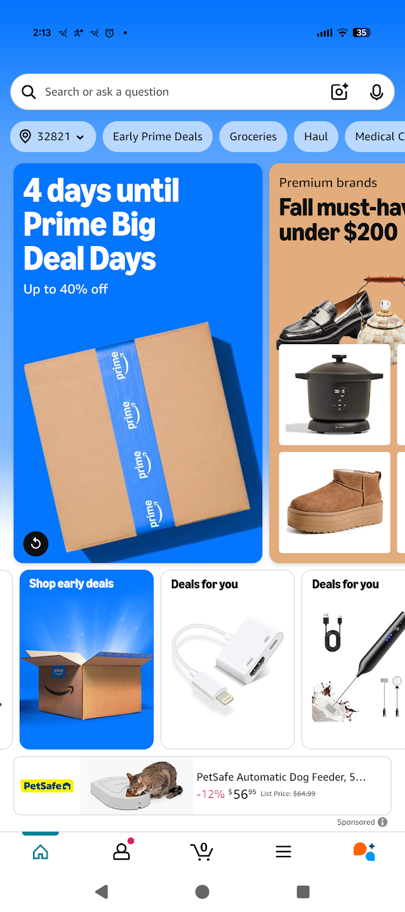

<!-- Title -->

<!-- _footer: "" -->
<!-- _paginate: skip -->

<!-- _class: talk_title invert -->

# What DBAs Don't Know About Mobile Apps and APIs

<br />

## Andy Lech

---

<!-- @@@ Sponsors @@@ -->

<!-- _footer: "" -->
<!-- _paginate: skip -->


---

<!-- @@@ Topics @@@ -->

<!-- _class: talk_topics -->

### Topics

- Supporting APIs as a more direct path to your data
- Guaranteeing uniqueness in a stateless API client
- Adding narrower slices of data for just-in-time consumption
- Providing context to database decisions through the API

---

<!-- @@@ Title @@@ -->

<!-- _class: section_title -->

## Part 1

* ### Imagine your house was an app ...

---

<!-- @@@ House - User @@@ -->

<!-- _class: details -->


<div>

### Energy - User

##### *[Web Site or Mobile App User]*

- Energy Consumption
  - Just Works
- Energy Production
  - Somebody Else's Problem
- Resiliency
  - Generator (Maybe?)
- <b>Focus</b>
  - <b>Living My Best Life</b>

</div>

<div class="attribution">
    <a href="https://www.freepik.com/free-vector/isometric-house-profile-concept_4278104.htm">
    Image by macrovector</a> on Freepik
</div>

---

<!-- @@@ House - Grid @@@ -->

<!-- _class: details -->


<div>

### Energy - Power Grid

##### *[Web Site or Single Page Application Dev]*

- User Consumption
  - Always
- Grid Production
  - Our Problem
- Resiliency
  - Our Backups Have Backups (Hopefully)
- <b>Focus</b>
  - <b>Keeping the Lights On (Literally)</b>

</div>

<div class="attribution">
    <a href="https://www.freepik.com/free-vector/plumbing-problems-solution-isometric-infographic-poster_4283915.htm">
    Image by macrovector</a> on Freepik
    <br />
    <i>[Equivalent energy image not available]</i>
</div>

---

<!-- @@@ House - Solar @@@ -->

<!-- _class: details -->


<div>

### Energy - Solar/Wind

###### *[Mobile App Dev]*

- Energy Production
  - Local
- Grid Consumption
  - Backup
- Grid Production
  - Their Problem
- Resiliency
  - Battery, Power Grid
- <b>Focus</b>
  - <b>Smartly Using and Storing Energy</b>

</div>

<div class="attribution">
    <a href="https://www.freepik.com/free-vector/isometric-modern-house_1086482.htm">
    Image by macrovector</a> on Freepik
</div>

---

<!-- @@@ Title @@@ -->

<!-- _class: section_title -->

## Part 2

* ### Mobile is just like Web but smaller,

* ### right!?

* ### or

* ### Web devs make bad Mobile devs

* ### ... but they can learn

---

<!-- @@@ Web vs Mobile - High-level @@@ -->

<!-- _class: details -->

### Web vs Mobile - High Level


<div class="commentary" style="padding: 20px 0px 0px;">

* Same thing, right? Problem solved! Crisis averted!
Thank you and good night!

</div>

---

<!-- @@@ Web Sites (Traditional) - Architecture @@@ -->

<!-- _class: details -->

### Web Sites (Traditional)

<p/>


<div class="detail-summary">

- Server/cloud stack is the focus here, turning data into pages and layouts
- Complex layouts are generally built on top of templating frameworks
- <b>Web devs expect fat data pipes in the server/cloud stack to get large data payloads (object graphs) to choose what to filter/display in page layouts</b>

</div>

---

<!-- @@@ Web Sites (Traditional) @@@ -->

<!-- _class: details -->

### Web Sites (Traditional)

<div class="two-columns">

<div>

#### *Browser (Client)*

- Requests: Browse, Submit
- State Management: Cookies
- Data Mapping: None
- Caching: Local, Session, Cookies
- Resiliency: Browser
- <b>Dev Focus: Interactivity, Data Updates</b>
- <b>Data Goal: Fat Data Pipes (to Site)</b>

</div>

<div>

#### *Site (Server/Cloud)*

- Responses: Page Layouts (Whole)
- State Management: Server/Cloud
- Data Mapping: Source to Site
- Caching: Server/Cloud
- Resiliency: Server/Cloud, Services
- <b>Dev Focus: Layouts, State, Services</b>
- <b>Data Goal: Fat Data Pipes (inside Site)</b>

<span class="break" />

</div>

</div>

---

<!-- @@@ Mobile Apps - Architecture @@@ -->

### Mobile Apps

<!-- _class: details -->


<div class="detail-summary">

- App handles interactivity, page layouts, local caching, and API calls
- API stack delivers only data or status codes in response to app requests
- App pages tend to be focused on single tasks that call the API selectively
- <b>Mobile/API devs focus more on reliable, just-in-time data delivery</b>

</div>

---

<!-- @@@ Mobile Apps - Summary @@@ -->

<!-- _class: details -->

### Mobile Apps

<div class="two-columns">

<div>

#### *App (Client)*

- Requests: API Calls
- State Management: ViewModels, Cache
- Data Mapping: API to App
- Caching: Platform, Local DB
- Resiliency: Network State
- <b>Dev Focus: Interactivity, Data Updates, Layouts, State, API Calls</b>
- <b>Data Goal: Smart Data Pipes (to API)</b>

</div>

<div>

#### *API (Server/Cloud)*

- Responses: Data (JSON/XML)
- State Management: Auth Tokens
- Data Mapping: Source to API
- Caching: Server/Cloud
- Resiliency: Server/Cloud, Services
- <b>Dev Focus: Data, Status Codes, Messages</b>
- <b>Data Goal: Smart Data Pipes (from App)</b>

</div>

</div>

---

<!-- @@@ Web Sites and Mobile Apps - Architecture @@@ -->

<!-- _class: details -->

### Web and Mobile - Two Paths to Data


<!-- - *** TODO *** -->

---

<!-- @@@ Part 3 Title @@@ -->

<!-- _class: section_title -->

## Part 3

* ### "It's the data, stupid"

* ### [Insert picture of James Carville]

* ### [Insert picture of The War Room whiteboard]

---

<!-- @@@ API Design - Operations @@@ -->

#### API Design - Operations

<p />

<div class="detail-summary">

- API calls are atomic operations that map closely to CRUD database operations

<br />

| Create | Read | Update | Delete |
|-|-|-|-|
| Insert | Select | Update | Delete |
| POST | GET | PATCH<br/>PUT | DELETE |

<p />

- Novice/lazy devs auto-generate API endpoints that map 1:1 to CRUD table operations

- Skilled devs curate API endpoints mapped to consumption patterns and app models

  + Data is often consumed like views of tables targeted to the specific tasks of pages

  + Audit trails don't need to be round-tripped to a consumer that may alter the data

</div>

---

<!-- @@@ API Design - Responses @@@ -->

#### API Design - Responses

<p />

<div class="detail-summary">

- API operations that succeed synchronously have expected data and status codes

<br />

| Method | Description | Response Status Code |
|-|-|-|
| PATCH  | Create/Modify the resource with JSON Merge Patch | `200-OK`, `201-Created` |
| PUT    | Create/Replace the *whole* resource | `200-OK`, `201-Created` |
| POST   | Create new resource (ID set by service) | `201-Created` with URL of created resource |
| POST   | Action | `200-OK` |
| GET    | Read (i.e. list) a resource collection | `200-OK` |
| GET    | Read the resource | `200-OK` |
| DELETE | Remove the resource | `204-No Content`\; avoid `404-Not Found` |

<br />

###### Source: Microsoft Azure REST API Guidelines [github.com/microsoft/api-guidelines](https://github.com/microsoft/api-guidelines/blob/vNext/azure/Guidelines.md)

</div>

---

<!-- @@@ API Design - State @@@ -->

#### API Design - Stateless State Management

<p />

<div class="detail-summary">

- JSON Web Tokens (JWTs) are commonly used to maintain state between API calls

- API clients get an encoded authentication token which contains the users rights

- API clients returns their tokens on successive calls which are matched to a secret key

- Secret keys are often generated on API server launch which may be tied a DB refresh

- More complex schemas for token generation and API rights and token expiration exist

<br />

###### Source: IETF RFC 7519 - JSON Web Token (JWT) [datatracker.ietf.org/doc/html/rfc7519](https://datatracker.ietf.org/doc/html/rfc7519)

</div>

---

<!-- @@@ API Design - Login @@@ -->

#### API Design - Local Cache

<p />

<div class="detail-summary">

- Tokens are often created on login, cached locally, and renewed in the background

- Apps often store the most recent token in fast secure platform-level key:value cache

- If a valid token exists on launch, the app can skip directly to a home page

</div>

<p />

<div class="two-columns" style="padding: 0px 0px;">

<div>


</div>

<div>



</div>

---

<!-- @@@ API Design - Conference - Schedule @@@ -->

<!-- _class: details -->

#### API Design - Conference - Schedule

<div class="two-columns" style="padding: 40px 0px;">

<div>

##### *Requirements*

- Everybody gets the same schedule
- The schedule changes infrequently
- When the schedule does change, it often involves multiple sessions
- Event Wi-Fi is notoriously fickle

<br />

##### *Solution*

* Send whole schedule w/o redundant data but time-gated and cached (check for status code `304-Not Modified`)

</div>

<div>


</div>

---

<!-- @@@ API Design - Conference - Itinerary @@@ -->

<!-- _class: details -->

#### API Design - Conference - Itinerary

<div class="two-columns" style="padding: 40px 0px;">

<div>

##### *Requirements*

- Everybody gets the same schedule
- Attendee adds sessions to itinerary
- Attendee shares their itinerary
- Event Wi-Fi is still fickle

<br />

##### *Solution*

* Send itinerary as updated when network is available, managing sync

</div>

<div>


</div>

---

<!-- @@@ API Design - Conference - Announcements @@@ -->

<!-- _class: details -->

#### API Design - Conference - Announcements

<div class="two-columns" style="padding: 30px 0px;">

<div>

##### *Requirements*

- Everybody gets the same schedule
- Everybody needs to get the same announcements
- Event Wi-Fi is more fickle now that everybody is checking their phones

<br />

##### *Solution*

* Use a highly-available service
* Poll API or wait for real-time data
* Or hope Slack, Twitter, etc. are up

</div>

<div>


</div>

---

<!-- @@@ Mobile Architecture - High-Level @@@ -->

<!-- _class: details -->

## Mobile Architecture - High Level

<br />


---

<!-- @@@ Mobile Architecture - Real World (cont.) @@@ -->

<!-- _class: details -->

## Mobile Architecture - Real-world

<div style="padding: 20px 0px;">

- ViewModels
  - Moving navigation out of the View allows ViewModels to be tested individually with frameworks like ReactiveUI (RxUI)
- Api Services
  - Individually testable to return app Models and not just Data Transfer Objects (DTOs)
- Data Service
  - Decides whether to call the local cache DB, the platform cache, an API endpoint, or a service based on the requested data and the app lifecycle

</div>

---

<!-- @@@ Mobile Architecture - Real World @@@ -->

<!-- _class: details -->

## Mobile Architecture - Real-world

<br />


---

<!-- @@@ API Design + App Design - Other Things @@@ -->

<!-- _class: details -->

#### API Design + App Design - Other Things

<div class="two-columns" style="padding: 30px 0px;">

<div>

##### *App Design*

- Centralized analytics
- Centralized logging
- Auto-generated API wrappers (Refit)
- Centralized API retry (Polly)
- Platform customizations (Xamarin.Essentials)
- Platform dependency-injection

</div>

<div>

##### *API Design*

- Authorization tokens
- Refresh tokens
- eTags
- Idempotency
- Other HTTP status codes
- ProblemDetails
- ValidationProblemDetails

</div>

</div>

<div class="detail-summary"
    style="padding: 1en 0px 0px !important; align: center !important;">

And so much more

</div>

---

<!-- @@@ Part 4 Title @@@ -->

<!-- _class: section_title -->

## Part 4

* ### Explain yourself, dammit

* ### [Insert picture of Lewis Black]

---

<!-- @@@ Problem Details - Description @@@ -->

<!-- _class: details -->

<div class="two-columns">

<div>

#### Problem Details

##### *Pros*

- Extensible JSON object
- Provides context to status code
- Can report errors or warnings
- Supported in .NET without ASP.NET
- Returned by Refit's ApiException

##### *Cons*

- Buggy return type in ASP.NET
- .NET implementations follow JSON

</div>

<div>

```json
# NOTE: '\' line wrapping per RFC 8792
{
  "$schema": "https://json-schema.org/draft/2020-12/schema",
  "title": "An RFC 7807 problem object",
  "type": "object",
  "properties": {
    "type": {
      "type": "string",
      "format": "uri-reference",
      "description": "A URI reference that identifies the problem type."
    },
    "title": {
      "type": "string",
      "description": "A short, human-readable summary of the problem type."
    },
    "status": {
      "type": "integer",
      "description": "The HTTP status code generated by the origin server \
for this occurrence of the problem.",
      "minimum": 100,
      "maximum": 599
    },
    "detail": {
      "type": "string",
      "description": "A human-readable explanation specific to this occurrence \
of the problem."
    },
    "instance": {
      "type": "string",
      "format": "uri-reference",
      "description": "A URI reference that identifies the specific occurrence \
of the problem. It may or may not yield further information if dereferenced."
    }
  }
}
```

</div>

</div>

###### Source: IETF RFC 9457 - Problem Details for HTTP APIs [www.rfc-editor.org/rfc/rfc9457.html](https://www.rfc-editor.org/rfc/rfc9457.html)

---

<!-- @@@ Problem Details - Logic Failure Example @@@ -->

<!-- _class: details -->

#### Problem Details - Logic Failure Example

<div class="two-columns">

<div>

```json
POST /purchase HTTP/1.1
Host: store.example.com
Content-Type: application/json
Accept: application/json, application/problem+json

{
  "item": 123456,
  "quantity": 2
}
```

</div>

<div>

```json
HTTP/1.1 403 Forbidden
Content-Type: application/problem+json
Content-Language: en

{
 "type": "https://example.com/probs/out-of-credit",
 "title": "You do not have enough credit.",
 "detail": "Your current balance is 30, but that costs 50.",
 "instance": "/account/12345/msgs/abc",
 "balance": 30,
 "accounts": ["/account/12345",
              "/account/67890"]
}
```

</div>

</div>

---

<!-- @@@ Problem Details - Logic Failure Example @@@ -->

<!-- _class: details -->

#### Problem Details - Validation Failure Example

<div class="two-columns">

<div>

```json
POST /details HTTP/1.1
Host: account.example.com
Content-Type: application/json
Accept: application/json, application/problem+json

{
  "age": 42.3,
  "profile": {
    "color": "yellow"
  }
}
```

</div>

<div>

```json
HTTP/1.1 422 Unprocessable Content
Content-Type: application/problem+json
Content-Language: en

{
 "type": "https://example.net/validation-error",
 "title": "Your request is not valid.",
 "errors": [
             {
               "detail": "must be a positive integer",
               "pointer": "#/age"
             },
             {
               "detail": "must be 'green', 'red' or 'blue'",
               "pointer": "#/profile/color"
             }
          ]
}
```

</div>

</div>

<!-- @@@ Demo - ProblemReports (PdHelpers) @@@ -->

<!-- # _class: details -->

<!-- ### Demo - ProblemReports (PdHelpers) -->

---

<!-- @@@ Questions? @@@ -->

<!-- _class: section_title -->

## Part 5

### Questions?

---

<!-- @@@ Sponsors @@@ -->

<!-- _footer: "" -->
<!-- _paginate: skip -->


